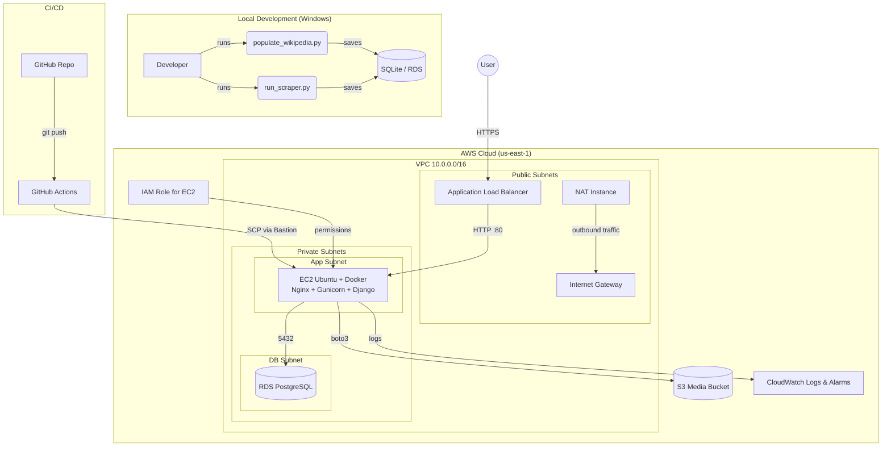

# 🔍 NicheSearch – Curated Niche Search Engine

A **DevSecOps capstone project** that delivers a secure, cost‑optimised, and beautifully minimalistic search engine for curated tech & knowledge articles. Built with **Django** on **AWS**, featuring automated content ingestion, user bookmarks, profile management, a relevance‑based page ranking algorithm, and a fully customisable admin dashboard.


---

## ✨ Features

- **🔎 Smart Search** – Dynamic relevance scoring (term frequency, exact title matches, static boosts).
- **📌 Bookmark Manager** – Create, view, and delete saved links.
- **👤 User Profiles** – Update username, email, and upload a profile picture (stored on **AWS S3**).
- **🔑 Password Change** – Users can update their password from the navbar.
- **🌓 Light/Dark Theme** – Toggle with a button (persists via `localStorage`), works for all users.
- **📰 Curated Content** – Articles from Hacker News, Dev.to, Ars Technica, and **1500+ Wikipedia summaries** across 25 topics.
- **📊 Custom Admin Dashboard** – Total scraped sites, users, bookmarks, plus direct link to manage users and reset passwords.
- **🐳 Dockerised** – Consistent environment with Gunicorn + Nginx.
- **🔒 Enterprise Security** – CSRF, XSS, HSTS, rate‑limiting, least‑privilege IAM roles, SSH hardening, UFW.
- **📈 Monitoring** – CloudWatch logs & CPU alarms.
- **🔄 CI/CD** – GitHub Actions pipeline automates deployment to AWS EC2.
- **💵 Cost‑Optimised** – Entirely within AWS Free Tier (t2.micro, t3.micro RDS, S3, 20 GB EBS).

---

## 🏗️ Architecture

### High‑Level Diagram



### How It Works

- **Local Scraping** populates the database with thousands of articles before deployment.
- **User Requests** arrive at the public ALB, are forwarded to the private EC2 instance, Nginx proxies to Gunicorn/Django, which queries RDS and returns ranked results.
- **CI/CD** builds the Docker image on push, transfers it via the bastion (NAT), and redeploys the container.
- **Security Groups** enforce least‑privilege networking; IAM roles grant S3 and CloudWatch access without secrets.

---

## 🛠️ Tech Stack

| Category            | Technology                                                                 |
|---------------------|----------------------------------------------------------------------------|
| Backend             | Django 4.2, Python 3.11                                                    |
| Web Server          | Gunicorn (WSGI)                                                            |
| Reverse Proxy       | Nginx                                                                      |
| Database            | PostgreSQL (AWS RDS) / SQLite (local dev)                                  |
| Storage             | AWS S3 (django‑storages + boto3)                                           |
| Frontend            | Tailwind CSS (CDN), minimal HTML5 templates with dark mode support         |
| Scraping            | BeautifulSoup4, Requests, wikipedia‑api                                    |
| Security            | django‑ratelimit, Django security middlewares, HSTS, SSH hardening, UFW    |
| Containerisation    | Docker                                                                     |
| Infrastructure      | Terraform (AWS VPC, EC2, RDS, S3, ALB, IAM)                               |
| CI/CD               | GitHub Actions                                                             |
| Monitoring          | AWS CloudWatch (logs, CPU alarms)                                          |
| Backup              | Shell script + cron (pg_dump, s3 sync)                                     |

---

## 📁 Project Structure

```
niche_search_project/
├── niche_search/                 # Django project settings
├── search/                       # Main application
│   ├── management/commands/      # run_scraper.py, populate_wikipedia.py
│   ├── templates/
│   │   ├── admin/
│   │   │   └── index.html        # Custom admin dashboard
│   │   ├── search/
│   │   │   ├── home.html
│   │   │   ├── bookmarks.html
│   │   │   └── profile.html
│   │   └── registration/
│   │       ├── login.html
│   │       ├── register.html
│   │       ├── password_change_form.html
│   │       └── password_change_done.html
│   ├── models.py                 # SearchResult, UserBookmark, UserProfile
│   ├── views.py                  # Search, login, bookmarks, profile
│   ├── urls.py
│   ├── ranking.py                # Relevance scoring algorithm
│   ├── signals.py                # Auto-create UserProfile
│   └── admin.py                  # Model registrations with custom admin site
├── Dockerfile
├── requirements.txt
├── manage.py
├── .env.example
├── .gitignore
├── terraform/
│   ├── main.tf
│   ├── variables.tf
│   ├── outputs.tf
│   └── terraform.tfvars.example
├── .github/workflows/deploy.yml  # CI/CD pipeline
├── backup.sh
└── README.md
```

---

## 🚀 Getting Started

### Prerequisites

- **Python 3.11+** & **pip**
- **Git**
- **Docker** (for building and running containers)
- **AWS Account** (free tier eligible)
- **Terraform** (for infrastructure provisioning)
- **AWS key pair** for EC2 access

### 1. Clone the Repository

```bash
git clone https://github.com/your-username/niche_search.git
cd niche_search_project
```

### 2. Local Development Setup

#### a) Virtual environment & dependencies

```bash
python -m venv venv
source venv/bin/activate        # Linux/macOS
venv\Scripts\activate           # Windows

pip install -r requirements.txt
```

#### b) Environment variables

Copy the example file and adjust as needed:

```bash
cp .env.example .env
```

For local testing with **SQLite**, set:

```env
DJANGO_SECRET_KEY=your-secret-key
DJANGO_DEBUG=True
DJANGO_ALLOWED_HOSTS=localhost,127.0.0.1
USE_SQLITE=True
```

#### c) Apply migrations & create superuser

```bash
python manage.py migrate
python manage.py createsuperuser
```

#### d) Populate the database (Wikipedia articles)

```bash
python manage.py populate_wikipedia
```

This fetches ~1500 summaries via the official Wikipedia API and stores them locally.

#### e) Run the development server

```bash
python manage.py runserver
```

Visit **http://127.0.0.1:8000** – you should see the search page.

### 3. Cloud Deployment (AWS)

#### a) Provision infrastructure with Terraform

```bash
cd terraform
terraform init
terraform apply -var="db_password=YourStrongPassword" -var="key_name=your-ec2-key-pair"
```

Note the outputs: `alb_dns`, `rds_endpoint`, `s3_bucket`, `nat_public_ip`, `app_private_ip`.

#### b) Configure the production `.env` on the EC2

SSH into the EC2 instance (via the NAT/bastion) and create `/opt/niche-search/.env` with the actual RDS and S3 details.

#### c) Build & run the Docker container

```bash
cd /opt/niche-search
docker build -t niche-search .
docker run -d --name niche-search --restart unless-stopped \
    -p 127.0.0.1:8000:8000 \
    --env-file .env \
    -v /opt/niche-search/logs:/app/logs \
    niche-search
```

#### d) Set up Nginx, firewall, SSH hardening (see full guide below)

#### e) Migrate & load data on the cloud database

```bash
docker exec -it niche-search python manage.py migrate
docker exec -it niche-search python manage.py createsuperuser
docker exec -it niche-search python manage.py populate_wikipedia
```

### 4. CI/CD with GitHub Actions

Add the following secrets to your GitHub repository:
- `SSH_KEY` – private key for EC2
- `BASTION_IP` – public IP of the NAT instance
- `APP_PRIVATE_IP` – private IP of the Django EC2

Push to `main` – the pipeline builds the Docker image, transfers it via SCP, and restarts the container.

### 5. Backup & Monitoring

- **Backup**: The script `/opt/backup.sh` runs nightly via cron, dumping the database and syncing S3 media locally.
- **CloudWatch Logs**: The CloudWatch agent streams `/opt/niche-search/logs/app.log` to CloudWatch Logs.
- **CPU Alarm**: An alarm triggers if CPU > 80% for two 5‑minute periods.

---

## 📖 Usage

- **Search**: Enter a keyword (e.g., “machine learning”) and see relevance‑ranked results.
- **Bookmark**: Log in, click “Save” on any result; view/remove bookmarks from the “📌 Bookmarks” page.
- **Profile**: Upload a profile picture, update username and email.
- **Change Password**: Click “🔑 Change Password” in the navbar.
- **Toggle Theme**: Click the 🌓 button to switch between light and dark themes (works for all users).
- **Admin Dashboard**: Visit `/admin`, log in as superuser, view stats, manage users, and reset passwords.

---

## 🧠 Page Ranking Algorithm

The custom ranking function (`search/ranking.py`) scores each result using:

- **Exact phrase match** in title → +3.0
- **Term frequency** in title (×2 weight)
- **Term frequency** in description
- **Description length penalty** (log‑normalised)
- **Static rank** from `SearchResult.rank` (optional, can be boosted)

Results are sorted by this score, so the most relevant articles appear first.

---

## 🤝 Contributing

This is a capstone project, but suggestions and improvements are welcome!  
1. Fork the repository  
2. Create a feature branch (`git checkout -b feature/amazing-feature`)  
3. Commit your changes (`git commit -m 'Add some amazing feature'`)  
4. Push to the branch (`git push origin feature/amazing-feature`)  
5. Open a Pull Request

---

## 📝 License

Distributed under the MIT License. See `LICENSE` for more information.

---

## 🎓 Acknowledgements

- Django documentation
- Wikipedia API (wikipedia‑api)
- AWS Free Tier
- Tailwind CSS
- Capstone supervisors and peers

---

**Built with ❤️ by Richard Pius**  
*DevSecOps Capstone Project – 2026*
